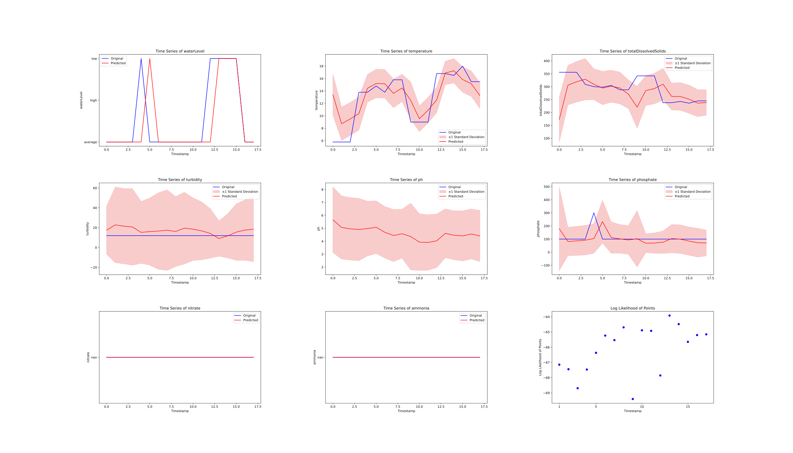

# UK_riverbank

This repo contains an analysis of a UK river dataset, focusing on the identification of anomalies and the key features that characterize them. The core task involved detecting irregularities within the provided data and understanding which data attributes are most significant for this detection. 

This challenge aligns with typical outlier detection scenarios, for which numerous methodologies exist.
The dataset comprised approximately 25,000 records and 60 columns. Initial examination revealed redundancy in several features; for example, various location identifiers (longitude, latitude, geometry coordinates, site, and river names) offered overlapping information for machine learning purposes. To address this, a refined set of 24 distinct input features was selected.

Our primary strategy for anomaly detection centered on time series analysis. By forecasting subsequent data points, we could then compare these predictions to actual observations. Significant discrepancies between predicted and observed values were classified as anomalies. Notably, features that do not change over time, such as land use classifications, were excluded from the predictive modeling phase as their future states are trivial to determine.

# First Results

Test loss when predicting average: 0.3556

Test loss when just predicting the last time step equal to the current time step: 0.1372

Test loss for lstm training: 0.0957

Test loss for transformer decoder: 0.0938

for more exemplary results see the newer figures folder.

# Datasources for Rain
https://data.ceda.ac.uk/badc/ukmo-midas-open
https://data.ceda.ac.uk/badc/ukmo-midas
https://data.ceda.ac.uk/badc/ukmo-nimrod
https://data.ceda.ac.uk/badc

# Notes on First Results:
Best Model seems to be small transformer. 256 hidden size 4 layer. 
Linear is slightly worse: -1.4 vs -1.5 roughly
Catchment basin only offers very small improvement

# Ideas:
- Add weather data
- Add graph structure
- make the model continuous (regular time steps no longer needed)
- use an LLM to get the most out of the csv data? i.e. encode the tabular information using llm embeddings of the title + table information.
